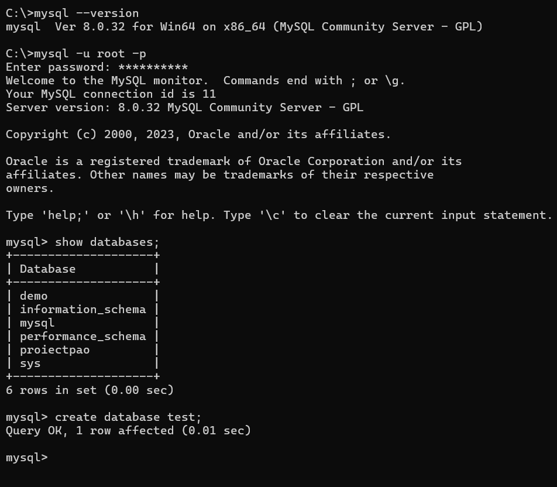
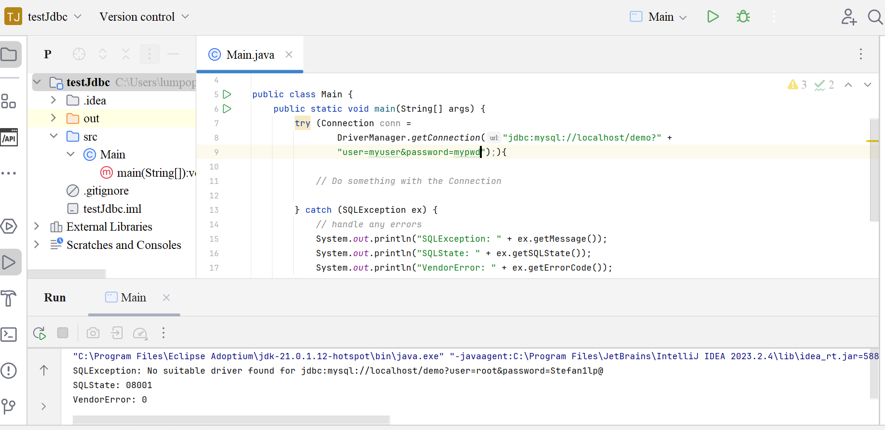
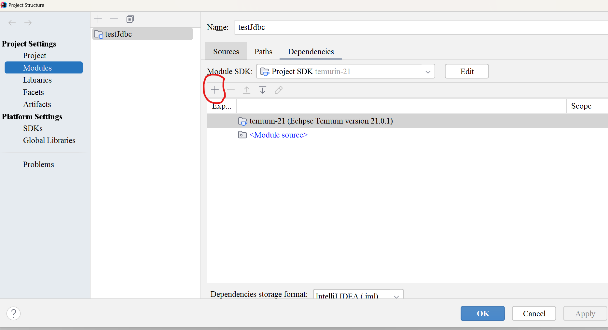
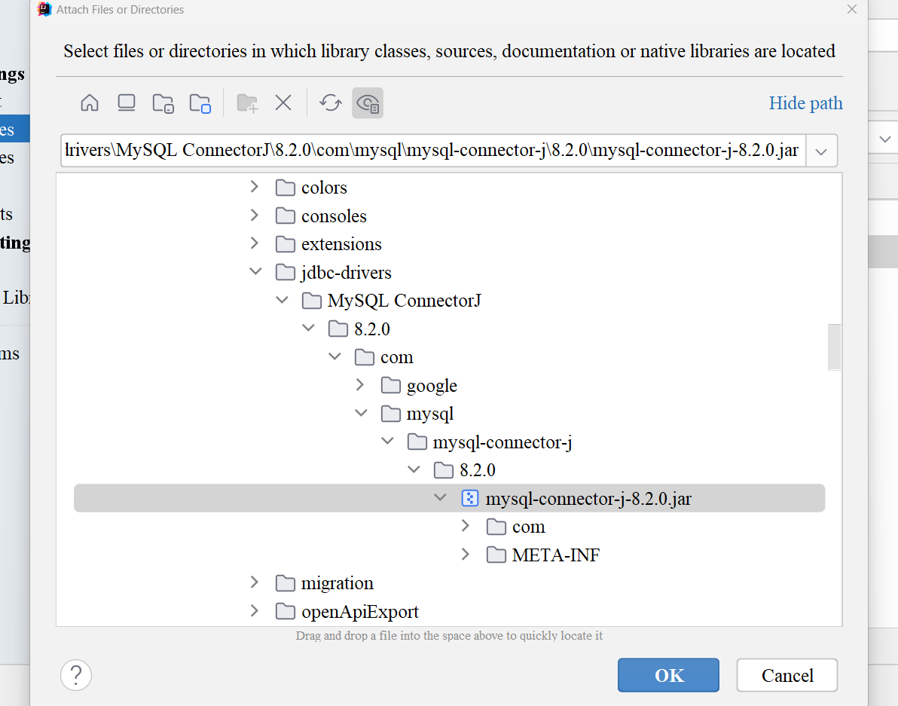
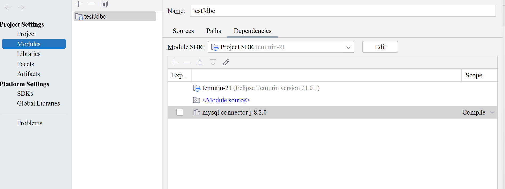
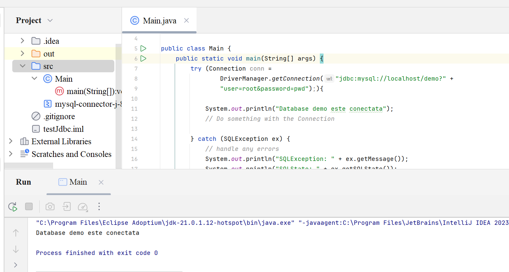
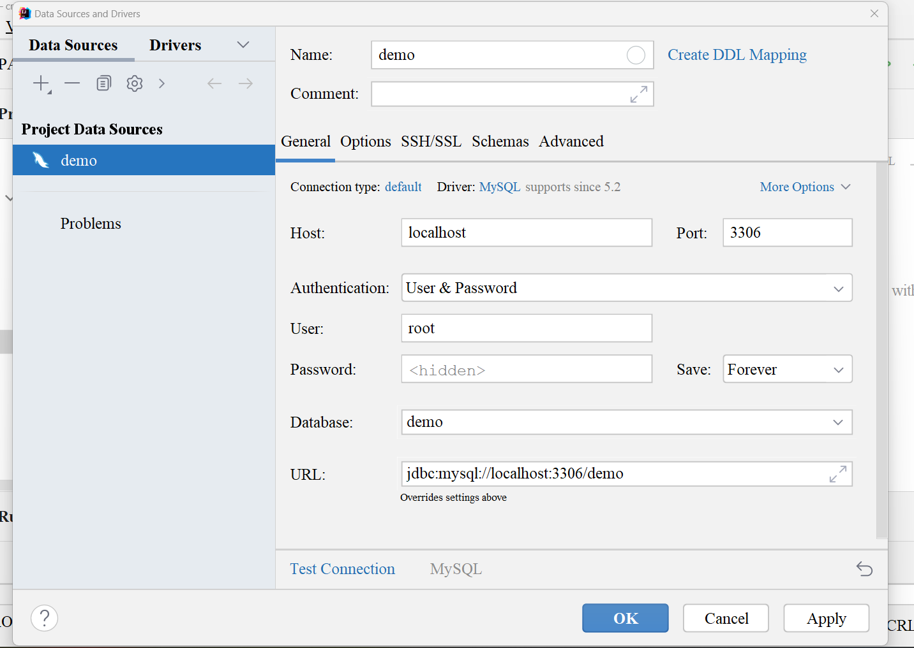
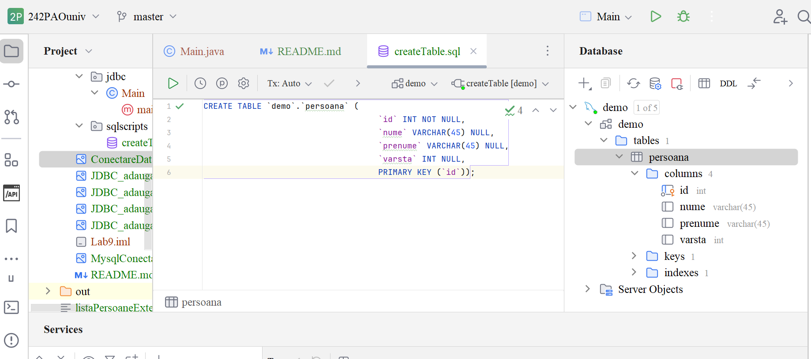

# **JDBC**

**MySql**
Instalare instructiuni https://www.youtube.com/watch?v=-PguJeJoO4c

instalare my sql https://dev.mysql.com/downloads/installer/

Ca sa fie ca pe youtube, pentru Windows se alege mysql-installer-community-8.0.32.0.msi

**Oracle**
https://www.oracle.com/database/technologies/xe-downloads.html
Oracle Database 21c Express Edition for Windows x64

Ca sa poata fi vizualizata baza de date SQL developer https://www.oracle.com/database/sqldeveloper/

**Proiect nou cu JDBC:**

New Java Project -> se genereaza noul proiect

Go to File -> Project Structure -> ProjectSettings -> Modules -> In dreapta se apasa + pentru adaugare Jars or Directories

Add Library -> Java 

Intellij deja are jar uri in folderul jdcc-drivers:

C:\Users\lumpopescu\AppData\Roaming\JetBrains\IntelliJIdea2023.2\jdbc-drivers\MySQL ConnectorJ\8.2.0\com\mysql\mysql-connector-j\8.2.0\mysql-connector-j-8.2.0.jar

Conectare baza de date din aplicatia Java:

Connection conn = DriverManager.getConnection("jdbc:mysql://localhost/demo", "root","parola");

sau

Connection conn = DriverManager.getConnection("jdbc:mysql://localhost/demo?" +
"user=root&password=parola");)

Aceasta conectare se face cu try with resources

    try(Connection conn = DriverManager.getConnection("jdbc:mysql://localhost/demo", "root","parola");){
        ...
    }catch(...){...}

Conectare DataSource in Intellij

